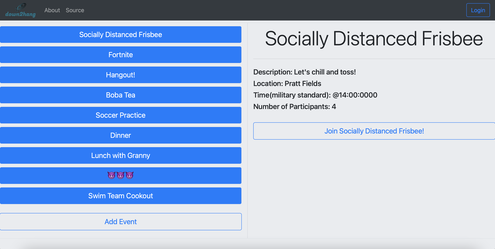
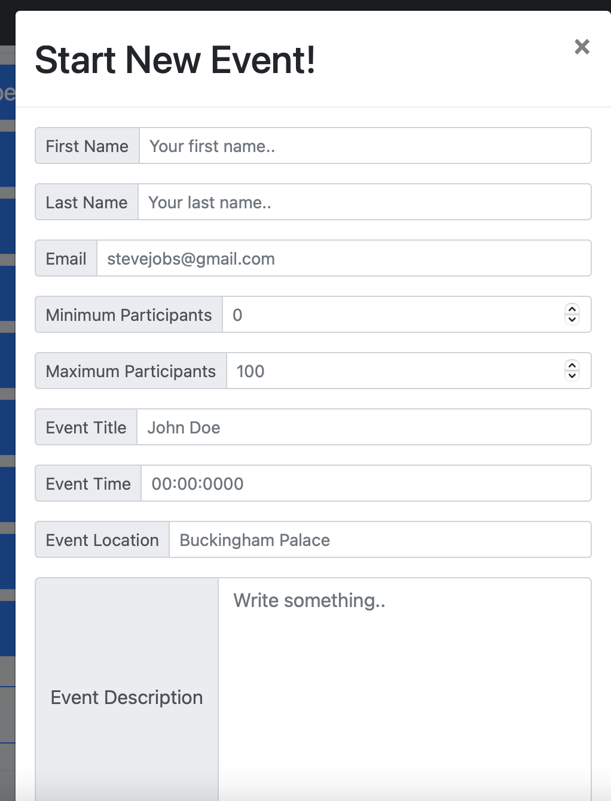
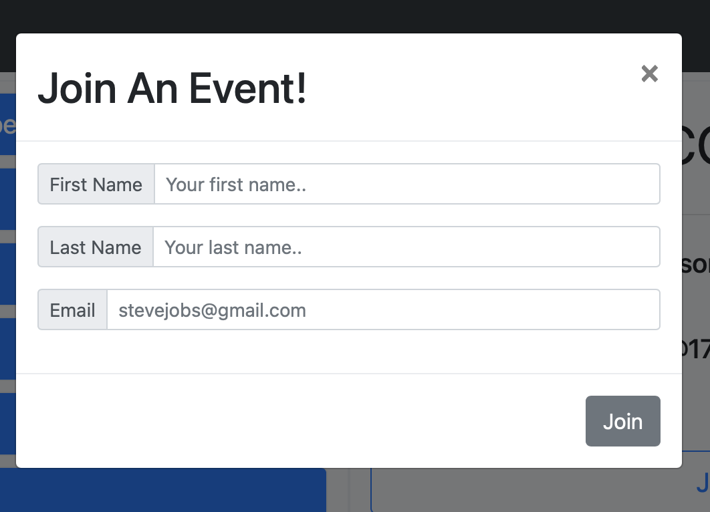
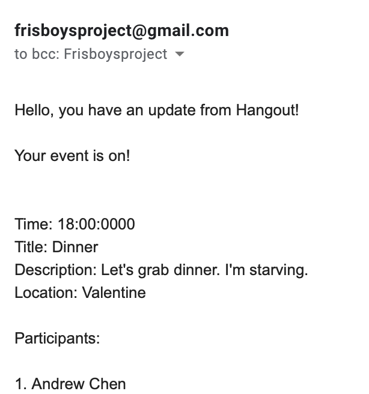

# Down2Hang

https://down2hang.co

https://youtu.be/_iN_NPPQ-dM
## Why create Down2Hang?

Getting enough people to come to frisbee practice can be a challenge. It's especially annoying when you need 14 players, for practice to be worthwhile. The pandemic made this even harder.

We hope that in the new year, after the pandemic, our website can be used to organize events for groups of people who want to (safely) coordinate fun activities. It's also a great way to make new friends in the new year.

## What it does

Down2Hang allows people to post and join events on our website and notifies people once the event has reached the specified minimum number of participants. No more showing up to frisbee practice and only finding 5 people there. Down2Hang keeps track of intended attendance and tells all participant when the minimum has been met, so people can confidently attend, knowing it's worth it.

## Browse and Join Events

## Create Events

## Join Events

## Get notified when your event has enough people to start.
Nobody interested? no event :(  
Enough people interested? We'll make sure you know!

